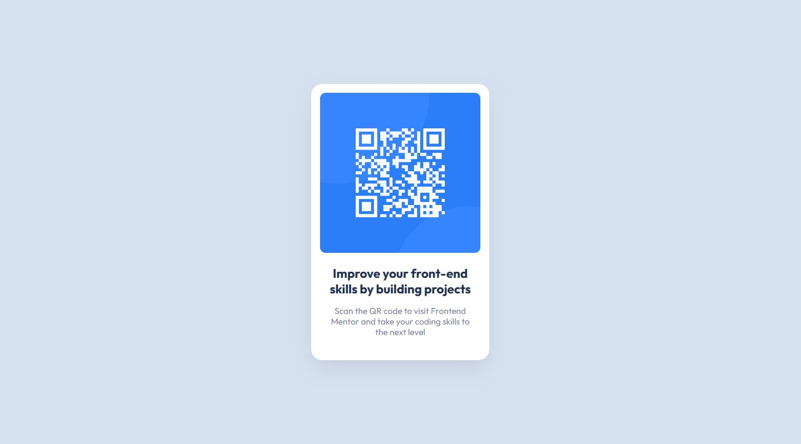

# Frontend Mentor - QR code component solution

This is a solution to the [QR code component challenge on Frontend Mentor](https://www.frontendmentor.io/challenges/qr-code-component-iux_sIO_H). Frontend Mentor challenges help you improve your coding skills by building realistic projects. 

## Table of contents

- [Overview](#overview)
  - [Screenshot](#screenshot)
  - [Links](#links)
- [My process](#my-process)
  - [Built with](#built-with)
  - [What I learned](#what-i-learned)
  - [Continued development](#continued-development)
  - [Useful resources](#useful-resources)
- [Author](#author)


## Overview

### Screenshot



-1440px


-375px

### Links

- Solution URL: [Add solution URL here](https://)
- Live Site URL: [Add live site URL here](https://)


## My process

### Built with

- Semantic HTML5 markup
- CSS custom properties
- Flexbox

### What I learned

While making this project, I could review about box-shadow and text-shadow.

```css
.main {
  box-shadow: 0 15px 40px 0 rgba(0, 0, 0, 0.08);
}
```

### Continued development

I'll keep trying to improve my CSS and will start doing some projects with JavaScript.

### Useful resources

- [text-shadow](https://developer.mozilla.org/en-US/docs/Web/CSS/text-shadow) - This made me remember somethings I've forgotten.
- [box-shadow](https://developer.mozilla.org/en-US/docs/Web/CSS/box-shadow) - It made me know about spread-radius value.


## Author

- Frontend Mentor - [@Somebodyidk](https://www.frontendmentor.io/profile/Somebodyidk)
